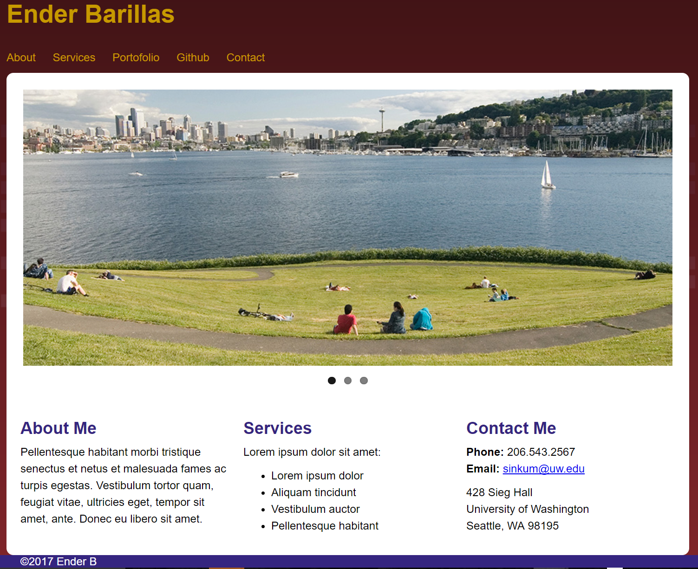

# HCDE 532: Web Design Studio

Class taken in the Winter 2017 quarter to learn web site design and programming principles.
Check out the website I created here: ~~https://students.washington.edu/enderb/index.php~~ **TODO:** add website to a different server, since I have graduated and lost access to the school's servers

